# nginx-demo

nginx 的出现，轻松解决了C10K的的问题，单机性能可以达到5W左右的并发，和Apache一样，虽然都是属于Http Server，但是nginx能支持的协议会更加丰富，也支持SMTP，POP3和IMAP协议。

HttpServer，WebServer，Application Server。Tomcat是Application Server，一般用于为应用服务器(Appcalition Server) 用来存放运行系统程序的服务器，负责处理程序中的业务逻辑，如Tomcat，Weblogic，jboss（现在大多数应用服务器也包含了Web 服务器的功能）

Http Server，http 服务器 一般用来访问静态的资源，而应用服务器可以动态地生成资源内容，比如Java的Servlet。所以nginx是一台httpserver，用来访问静态的资源。

nginx也可以通过模块开发来提供应用功能，Tomcat也可以直接提供Http服务，通常用在内网和不需要流控等小型服务场景（小型的应用服务器，不追求性能的业务，用不到nginx）

因为http服务器泡在应用服务器中，例如tomcat是也是一台http服务器，springboot也内嵌的tomcat，因为http服务器跑在应用服务器的前面，所以也叫代理服务器。

一般来说Http服务器和应用服务器是一起使用的，比如运行多个tomcat，通过Nginx实现负载均衡，或者把静态资源放在nginx，动态资源放在tomcat，实现动静分离。

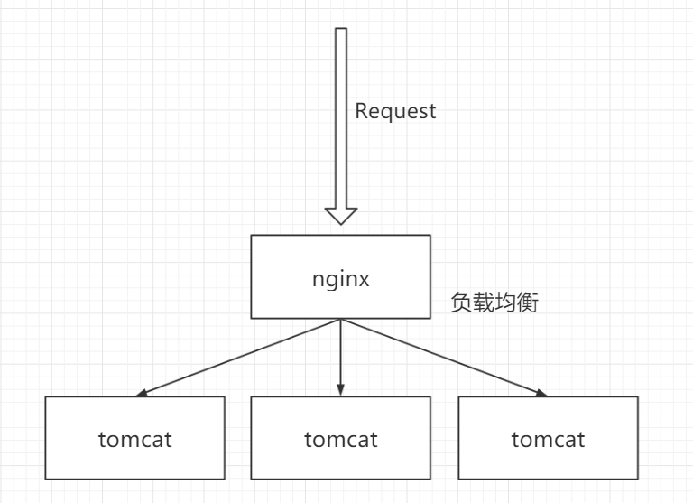


C10K就是单机支持1万个并发连接的问题(Concurrency 10K)。


#### HTTP 协议基本知识

##### IP 和 端口

IP 是分配给网卡的地址，用来在网络中定位一台设备，能够在庞大的网络中找到一台设备的话，就意味着可以进行通信。

IP的格式是四个8位的二进制整数，分成四段，每段可以转换成0-255的十进制数字。

由于一台设备上会运行很多程序，所以要在设备上要找到某个应用程序，还需要端口号，所以必须给每个程序分配一个端口。端口的范围是 0-65535。

当然，我们已知道的应用，例如FTP服务的21端口，HTTP的80端口，MySql的3306，Redis的6379端口。

##### HTTP 协议的请求类型

* GET

  * 请求指定的页面信息，并返回实体主题

* HEAD

  * 类似于GET请求，只不过在返回的响应中没有具体的内容

* POST

  * 向指定资源提交数据进行处理请求，数据被包含在请求体中。

* PUT

  * 从客户端向服务端传送的数据取代指定的文档内容。

* DELETE

  * 请求服务器删除指定页面

* CONNECT

  * HTTP/1.1 协议中预留给能够将连接改为管道放置的代理服务器

* OPTIONS

  * 允许客户端查看的服务器地性能。

* TRACE

  * 回显服务器收到的请求，主要用于测试和诊断。

  

##### HTTP 格式响应状态码有哪些

| 响应码 | 类型                           | 含义                       |
| ------ | ------------------------------ | -------------------------- |
| 1XX    | Informational(信息性状态码)    | 接受的请求正在处理         |
| 2XX    | Success(成功状态码)            | 请求正常处理完毕           |
| 3XX    | Redirection(重定向状态码)      | 需要进行附加操作以完成请求 |
| 4XX    | Client Error(客户端错误状态码) | 服务器无法处理请求         |
| 5XX    | Server Error(服务器错误状态码) | 服务器处理请求出错         |

请求、响应的Header字段有哪些?

https://www.w3.org/Protocols/rfc2616/rfc2616-sec14.html

##### 通用Header字段

| 字段              | 含义                                       |
| ----------------- | ------------------------------------------ |
| Cache-Control     | 控制缓存的行为                             |
| Connection        | 控制不再转发给代理的首部字母、管理持久连接 |
| Date              | 创建报文的日期时间                         |
| Pragma            | 报文指定                                   |
| Trailer           | 报文末端的首部一览                         |
| Transfer-Encoding | 指定报文主题的传输编码方式                 |
| Upgrade           | 升级为其它协议                             |
| Via               | 代理服务器的相关信息                       |
| Warning           | 错误通知                                   |

##### 请求Header字段

| 字段                | 含义                                        |
| ------------------- | ------------------------------------------- |
| Accept              | 用户代理可处理得媒体类型                    |
| Accept-Charset      | 优先的字符集                                |
| Accept-Encoding     | 优先的内容编码                              |
| Accept-Language     | 优先的语言(自然语言)                        |
| Authorization       | Web 认证信息                                |
| Expect              | 期待服务器的特定行为                        |
| From                | 用户的电子邮箱地址                          |
| Host                | 请求资源所在服务器                          |
| If-Match            | 比较实体标记(ETag)                          |
| If-Modified-Since   | 比较资源的更新时间                          |
| If-None-Match       | 比较实体标记(与If-Match相反)                |
| If-Range            | 资源未更新时发送实体Byte的范围请求          |
| If-Unmodified-Since | 比较资源的更新时间(与If-Modified-Since相反) |
| Max-Forwards        | 最大传输逐跳帧                              |
| Proxy-Authorization | 代理服务器要求客户端的认证信息              |
| Range               | 实体的字节范围请求                          |
| Referer             |                                             |
| TE                  | 传输编码的优先级                            |
| User-Agent          | HTTP 客户端程序的信息                       |

##### 响应头

| 字段               | 含义                         |
| ------------------ | ---------------------------- |
| Accept-Ranges      | 是否接受字节范围请求         |
| Age                | 推送资源创建经过时间         |
| ETag               | 资源的匹配信息               |
| Location           | 令客户端重定向至指定URI      |
| Proxy-Authenticate | 代理服务器对客户端的认证信息 |
| Retry-After        | 对再次发起请求的实际要求     |
| Server             | HTTP 服务器的安装信息        |
| Vary               | 代理服务器缓存的管理信息     |
| WWW-Authenticate   | 服务器对客户端的认证信息     |

##### 实体头

即请求和响应头都可以携带的消息，用来标识该内容的具体内容，例如长度，能接受的长度之类。

<https://developer.mozilla.org/en-US/docs/Glossary/Entity_header>

| 字段             | 含义                   |
| ---------------- | ---------------------- |
| Allow            | 资源可支持的HTTP方法   |
| Content-Encoding | 实体主体使用的编码方式 |
| Content-Language | 实体主题自然语言       |
| Content-Length   | 实体主题大小           |
| Content-Location | 替代对应的资源URI      |
| Content-MD5      | 实体主题的报文摘要     |
| Content-Range    | 实体主题的位置范围     |
| Content-Type     | 实体主题的媒体范围     |
| Expires          | 实体主题过期的日期时间 |
| Last-Modified    | 资源最后修改日期时间   |

#### CentOS7下安装 nginx

##### 软件安装方式

同一个软件有很多种不同的安装方式，Linux操作系统中安装软件有几种常见方式：
1、源码编译安装：一般需要解压然后用make 、make install等命令，这种方式步骤比较复杂，编译时间长，而且结果不可控
2、RPM（RedHat Package Manager）是一个软件管理包，安装卸载变得简单了，但是无法解决软件包之间的依赖关系问题
3、YUM（Yellow dog Updater, Modified）是一个RPM的前端程序，可以自动解决软件的依赖关系。但是要注意版本的问题，默认从仓库中获取安装的不一定是最新版本
4、不需要安装只要配置环境变量的（解压就可以使用）

##### 下载

地址从`http://nginx.org/en/download.html`复制

```
cd /usr/local/soft
wget http://nginx.org/download/nginx-1.18.0.tar.gz
```

#####  解压

```
tar -xzvf nginx-1.18.0.tar.gz
```

#####  安装依赖环境

gcc环境：基本运行环境
pcre：用于nginx的http模块解析正则表达式
zlib：用户进行gzip压缩
openssl：用于nginx https协议的传输

```
yum install -y gcc-c++ pcre pcre-devel zlib zlib-devel openssl openssl-devel
```

#####  编译安装

–prefix=/usr/local/soft/nginx 的意思是把nginx安装到/usr/local/soft/nginx
所以后面会有一个源码目录nginx-1.18.0，一个编译安装后的目录nginx

```
cd /usr/local/soft/nginx-1.18.0
./configure --prefix=/usr/local/soft/nginx 
make && sudo make install
cd /usr/local/soft/nginx/
```

测试配置是否成功：

```
/usr/local/soft/nginx/sbin/nginx -t -c /usr/local/soft/nginx/conf/nginx.conf
```

#####  启动Nginx

```
/usr/local/soft/nginx/sbin/nginx
```

浏览器直接访问IP（HTTP协议默认80端口，不需要输入）：


#####  copy vimfile

为了让VIM查看nginx配置文件时语法高亮，需要把相应文件copy到VIM目录。
先确定本机的vimfiles目录在哪个位置。

```
find / -name vimfiles
cd /usr/local/soft/nginx-1.18.0
cp -r contrib/vim/* /usr/share/vim/vimfiles/
```

#####  常用命令

```
nginx -s reopen #重启Nginx

nginx -s reload #重新加载Nginx配置文件，然后以优雅的方式重启Nginx

nginx -s stop #强制停止Nginx服务

nginx -s quit #优雅地停止Nginx服务（即处理完所有请求后再停止服务）

nginx -t #检测配置文件是否有语法错误，然后退出

nginx -?,-h #打开帮助信息

nginx -v #显示版本信息并退出

nginx -V #显示版本和配置选项信息，然后退出

nginx -t #检测配置文件是否有语法错误，然后退出

nginx -T #检测配置文件是否有语法错误，转储并退出

nginx -q #在检测配置文件期间屏蔽非错误信息

nginx -p prefix #设置前缀路径(默认是:/usr/share/nginx/)

nginx -c filename #设置配置文件(默认是:/etc/nginx/nginx.conf)

nginx -g directives #设置配置文件外的全局指令

killall nginx #杀死所有nginx进程
```


##### Nginx 配置文件

指定大全: http://nginx.org/en/docs/dirindex.html

##### 虚拟主机

大概的意思就是，当购买了一个较大空间的服务器的时候，可以出租给不同的想要部署项目的人，而这些项目可能并不是那么需要内存和CPU资源，例如一些发表文章的博客什么之类得。

这个时候，我们可以通过nginx来配置虚拟主机，当用户输入某个域名的时候，将会和nginx的配置文件上的`server_name`进行匹配这些域名和下面得资源。而我们要做的，只是在某个目录下给他们分配相应目录的使用权限即可，让他们上传部署自己的项目，然后通过nginx的映射，找到部署项目的入口。

```tiki wiki
[root@VM-0-15-centos nginx]# ls
client_body_temp  conf  fastcgi_temp  html  logs  proxy_temp  sbin  scgi_temp  uwsgi_temp
[root@VM-0-15-centos nginx]# mkdir data
[root@VM-0-15-centos nginx]# ll
total 40
drwx------ 2 nobody root 4096 Feb 28 15:07 client_body_temp
drwxr-xr-x 2 root   root 4096 Feb 28 15:32 conf
drwxr-xr-x 2 root   root 4096 Feb 28 23:11 data
drwx------ 2 nobody root 4096 Feb 28 15:07 fastcgi_temp
drwxr-xr-x 2 root   root 4096 Feb 28 15:06 html
drwxr-xr-x 2 root   root 4096 Feb 28 23:03 logs
drwx------ 2 nobody root 4096 Feb 28 15:07 proxy_temp
drwxr-xr-x 2 root   root 4096 Feb 28 15:06 sbin
drwx------ 2 nobody root 4096 Feb 28 15:07 scgi_temp
drwx------ 2 nobody root 4096 Feb 28 15:07 uwsgi_temp
## 我们可以随意在磁盘上创建希望给用户使用的磁盘目录，我们这里给直接在nginx的目录下面创建目录。
[root@VM-0-15-centos nginx]# cd data
[root@VM-0-15-centos data]# mkdir pop
[root@VM-0-15-centos data]# mkdir pipi
[root@VM-0-15-centos data]# mkdir bob
[root@VM-0-15-centos data]# ll
total 12
drwxr-xr-x 2 root root 4096 Feb 28 23:14 bob
drwxr-xr-x 2 root root 4096 Feb 28 23:14 pipi
drwxr-xr-x 2 root root 4096 Feb 28 23:14 pop
## 这样我们位 bob pipi pop 创建了属于他们自己的磁盘空间。
## 接着为了模拟一个他们自己部署了项目，我们为他们创建一个index.html页面，并写点什么，到时候访问的时候，方便获取到响应地部署信息。
[root@VM-0-15-centos bob]# cat index.html
I'M BOB
[root@VM-0-15-centos bob]# 
### 以上我们为每个文件夹都创建了属于他们自己的 index文件，文件内容都是他们的名字。
[root@VM-0-15-centos conf]# cp nginx.conf ./nginx-domains.conf
[root@VM-0-15-centos conf]# ll
total 72
-rw-r--r-- 1 root root 1077 Feb 28 15:06 fastcgi.conf
-rw-r--r-- 1 root root 1077 Feb 28 15:06 fastcgi.conf.default
-rw-r--r-- 1 root root 1007 Feb 28 15:06 fastcgi_params
-rw-r--r-- 1 root root 1007 Feb 28 15:06 fastcgi_params.default
-rw-r--r-- 1 root root 2837 Feb 28 15:06 koi-utf
-rw-r--r-- 1 root root 2223 Feb 28 15:06 koi-win
-rw-r--r-- 1 root root 5231 Feb 28 15:06 mime.types
-rw-r--r-- 1 root root 5231 Feb 28 15:06 mime.types.default
-rw-r--r-- 1 root root 2656 Feb 28 15:06 nginx.conf
-rw-r--r-- 1 root root 2686 Feb 28 15:32 nginx.conf.default
-rw-r--r-- 1 root root 2656 Feb 28 23:24 nginx-domains.conf
-rw-r--r-- 1 root root  636 Feb 28 15:06 scgi_params
-rw-r--r-- 1 root root  636 Feb 28 15:06 scgi_params.default
-rw-r--r-- 1 root root  664 Feb 28 15:06 uwsgi_params
-rw-r--r-- 1 root root  664 Feb 28 15:06 uwsgi_params.default
-rw-r--r-- 1 root root 3610 Feb 28 15:06 win-utf
## 我们对nginx-conf做一个备份，来做这个演示案例 nginx-domains.conf
```

其它部分直接复制原本的配置，只是加了几个映射

```properties

#user  nobody;
worker_processes  1;

#error_log  logs/error.log;
#error_log  logs/error.log  notice;
#error_log  logs/error.log  info;

#pid        logs/nginx.pid;


events {
    worker_connections  1024;
}


http {
    include       mime.types;
    default_type  application/octet-stream;

    #log_format  main  '$remote_addr - $remote_user [$time_local] "$request" '
    #                  '$status $body_bytes_sent "$http_referer" '
    #                  '"$http_user_agent" "$http_x_forwarded_for"';

    #access_log  logs/access.log  main;

    sendfile        on;
    #tcp_nopush     on;

    #keepalive_timeout  0;
    keepalive_timeout  65;

    #gzip  on;

    server {
        listen       80;
        server_name  localhost;

        #charset koi8-r;

        #access_log  logs/host.access.log  main;

        location / {
            root   html;
            index  index.html index.htm;
        }

        #error_page  404              /404.html;

        # redirect server error pages to the static page /50x.html
        #
        error_page   500 502 503 504  /50x.html;
        location = /50x.html {
            root   html;
        }

        # proxy the PHP scripts to Apache listening on 127.0.0.1:80
        #
        #location ~ \.php$ {
        #    proxy_pass   http://127.0.0.1;
        #}

        # pass the PHP scripts to FastCGI server listening on 127.0.0.1:9000
        #
        #location ~ \.php$ {
        #    root           html;
        #    fastcgi_pass   127.0.0.1:9000;
        #    fastcgi_index  index.php;
        #    fastcgi_param  SCRIPT_FILENAME  /scripts$fastcgi_script_name;
        #    include        fastcgi_params;
        #}

        # deny access to .htaccess files, if Apache's document root
        # concurs with nginx's one
        #
        #location ~ /\.ht {
        #    deny  all;
        #}
    }
    
   # 用来演示不同域名之间的转发


    # another virtual host using mix of IP-, name-, and port-based configuration
    #
    server {
        listen       80;
        server_name  www.pop.com;
	# 根目录所在位置
		root    /usr/local/soft/nginx/data/pop;
        location / {
            index  index.html index.htm;
        }
    }
    
    server {
        listen	     80;
		server_name  www.pipi.com;
		root   /usr/local/soft/nginx/data/pipi;
		location / {
             index index.html index.htm;
		}
    }	

    server {
        listen       80;
		server_name www.bob.com
		root /usr/local/soft/nginx/data/bob;
		location / {
             index index.html index.htm;
		}
      
    }


    # HTTPS server
    #
    #server {
    #    listen       443 ssl;
    #    server_name  localhost;

    #    ssl_certificate      cert.pem;
    #    ssl_certificate_key  cert.key;

    #    ssl_session_cache    shared:SSL:1m;
    #    ssl_session_timeout  5m;

    #    ssl_ciphers  HIGH:!aNULL:!MD5;
    #    ssl_prefer_server_ciphers  on;

    #    location / {
    #        root   html;
    #        index  index.html index.htm;
    #    }
    #}

}

```

为此，我们还需要更改一下域名，由于正确的域名解析流程需要通过dns域名解析服务器得到ip地址才可以完成，所以我们这边直接通过修改host文件的方式直接获得地址。

```
# 直接映射路径 这里写目标地址的IP地址
115.XXX.XXX.127  www.pop.com www.pipi.com www.bob.com
```

准备就绪后，我们就可以启动nginx了。在此之前为了更方便的启动，我们可以起别名。

```tiki wiki
# 查看别名的指令
[root@VM-0-15-centos conf]# alias
alias cp='cp -i'
alias egrep='egrep --color=auto'
alias fgrep='fgrep --color=auto'
alias grep='grep --color=auto'
alias l.='ls -d .* --color=auto'
alias ll='ls -l --color=auto'
alias ls='ls --color=auto'
alias mv='mv -i'
alias rm='rm -i'
alias which='alias | /usr/bin/which --tty-only --read-alias --show-dot --show-tilde'
# 编辑 ~表示当前用户，的方言指定
# 格式为 alias [命令]=[对应的文件命令1];[对应的文件命令2]
# 多个不同指令可以用 分号(;)隔开
[root@VM-0-15-centos conf]# vim ~/.bashrc
# 修改完后，重新编译下
[root@VM-0-15-centos conf]# source ~/.bashrc
# 启动 nginx,是使用对应的配置文件
[root@VM-0-15-centos sbin]# ./nginx -c /usr/local/soft/nginx/conf/nginx-domains.conf 
```

下面就是Nginx实现虚拟主机的效果


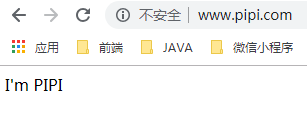


如果之后的配置文件多了起来，我们还可以使用http模块下的inculde功能，或者用通配符，包含这些文件配置。

```properties
http {
	# 就是这样
    include       /usr/local/soft/nginx/conf/vhost/*.conf;
    default_type  application/octet-stream;
```

有了这个，我们甚至可以用来映射子目录之类的，子域名。例如我希望在pop文件夹下再创建一个blob来放置博客的网址，所以我们可以映射子域名成这样 blob.pop.com。

#### Nginx 的反向代理

首先说正向代理，由于国内环境，有些网站我们是上不了的，因为此路不同，所以我们必须绕路，而因为有些路是可以走到我们需要的网站，所以我们可以通过走这些路来达到我们的目的地。这就是我们的正向代理，也就是我们常说的科学上网，我们通过可以上这些网站的ip地址，来请求目标地址，然后返回数据到正向代理，接着代理再把数据发给我们，达到访问的目的。

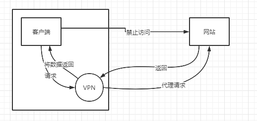

所以，**正向代理是运行在客户端得程序**。

那么**反向代理，顾名思义，就是运行在服务端的程序**。

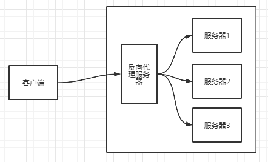

##### 关于反向代理的配置

由于反向代理是代理服务器，反向代理的效果就是，我请求一个代理方的地址，他会帮我想目标地址请求地址。

我们可以创建一个springboot项目，然后创建一个地址，随便什么地址，只要能够保证访问就行。

```java
@RestController
public class NginxController{
    @RequestMapping("user/query")
    public String query(HttpSerlvetRequest request){
        return "nice";
    }
}
```

假设我们现在这个springboot所在的地址是`192.168.44.1:9096`，也就是说我们使用`192.168.44.1:9096/user/query`页面上就会返回nice字样。但是因为某些原因，以上的地址我们使用让我们无法访问。这个时候，我们的反向代理，也就是nginx所在地址是`192.168.44.181`，而nginx可以访问`192.168.44.1`的服务，所以我们希望在网址上输入`192.168.44.1/user/query`,虽然不是真正服务器的地址，但是还是会返回nice字样。

我们回到nginx的地方进行配置。

```properties
server {
        listen       80;
        # nginx 所在的位置，只要服务器和这个匹配就会进入这个server块
        server_name  192.168.44.1;
        location / {
        # 非常重要的属性，用于表示被代理的地址，反向代理的位置，所有的请求都会被转发到这个地址
            proxy_pass http://192.168.44.1:9096;
        }
    }

```

启动nginx即可。

```properties
location / {
	// location 的路由规则    
}
```

| 模式                 | 含义                                                         |
| -------------------- | ------------------------------------------------------------ |
| location = /uri      | = 表示精准匹配，只有完全匹配上才能生效                       |
| location ^~ /uri     | ^~ 开头对URL路径进行前缀匹配，并且在正则之前                 |
| localtion ~pattern   | 开头表示区分大小写的正则匹配                                 |
| localtion ~* pattern | 开头表示不区别大小写的正则表达式                             |
| location /uri        | 不带任何修饰符，也表示前缀匹配，但是在正则匹配之后           |
| localtion /          | 通用匹配，任何匹配到其他location的请求都会匹配到，相当于switch 中的 default |

优先级从高到底。

所以其实就是nginx帮你发一个请求而已。所以在nginx帮你转发请求的时候，其实可以做一些特别的事情。

例如nginx可以帮你把一个get请求改变成post请求。比如你发送给nginx服务器是一个get请求，只需要在server块中加上这样一句话，就可以改成post请求。

```properties
server {
        listen       80;
        # nginx 所在的位置，只要服务器和这个匹配就会进入这个server块
        server_name  192.168.44.1;
        location / {
        # 非常重要的属性，用于表示被代理的地址，反向代理的位置，所有的请求都会被转发到这个地址
            proxy_pass http://192.168.44.1:9096;
            # 修改请求类型
            proxy_method POST;
        }
    }
```

本质上，我们作为客户端想nginx发送了一次请求，然后nginx作为客户端再发送了一次请求，那么这里就会有一个问题，由于到真正服务器的上是由nginx发送的，所以会丢失一些我们作为真正发送者的信息，所以我们希望在nginx转发的时候，能够保存我们原始的信息。

```properties
server {
        listen       80;
        # nginx 所在的位置，只要服务器和这个匹配就会进入这个server块
        server_name  192.168.44.1;
        location / {
        # 非常重要的属性，用于表示被代理的地址，反向代理的位置，所有的请求都会被转发到这个地址
            proxy_pass http://192.168.44.1:9096;
            # 修改请求类型
            proxy_method POST;
            # 前面是变量名，后面是值
            # host地址
            proxy_set_header Host $host;
            # 调用地址
            proxy_set_header X-Real-IP $remote_addr;
            # ip列表
            proxy_set_header X-Forwarded-For $proxy_add_x_forwarded_for;
        }
    }
```

##### 一些可以使用的变量

| 变量                               | 含义                                                         |
| ---------------------------------- | ------------------------------------------------------------ |
| $bytes_sent                        | 发送给客户端的总字节数                                       |
| $connection                        | 连接的序列号                                                 |
| $connection_requests               | 当前通过一个连接获得的请求数量                               |
| $msec                              | 日志写入时间，单位为秒，精度是毫秒                           |
| $pipe                              | 如果请求是通过HTTP流水线(pipelined)发送，pipe值为“p”，否则为“.” |
| $request_length                    | 请求的长度，包括请求行，请求头和请求正文                     |
| $request_time                      | 请求处理时间，单位为秒，精度为毫秒，从读入客户端的第一个字节开始，知道把最后一个字符发送给客户端后进行日志写入为止 |
| $status                            | 记录请求状态                                                 |
| $time_iso8601                      | ISO8601标准格式下的本地时间                                  |
| $time_local                        | 通用日志格式下的本地时间                                     |
| $remote_addr,$http_x_forwarded_for | 记录客户端的IP地址                                           |
| $remote_user                       | 记录客户端的用户名称                                         |
| $request                           | 记录请求的URL和HTTP协议                                      |
| $http_referer                      | 记录从哪个页面链接访问过来                                   |
| $body_bytes_sent                   | 发送给客户端的字节数，不包括响应头的大小，该变量是Apache模块mod_log_config里的“%B”参数兼容 |
| $http_user_agent                   | 记录客户端浏览器相关信息                                     |

我们可以通过自定义的变量来存储这些值。$开头是nginx内置的变量。

到服务端获取。

```java
@RequestMapping("user/query")
public String query(HttpServletRequest request){
    //从request header 中获取
    System.out.println("客户端IP"+request.getHeader("X-Real-IP"));
    System.out.println("X-Forwarded-For"+request.getHeader("X-Forwaded-For"));
}
```

##### 负载均衡


如何在nginx配置负载均衡。

```properties
server {
    listen  80;
    server_name localhost;
    location / {
    	# 后面的 test 是服务器组的配置
        proxy_pass http://test
    }
}
# 你可以在test 只是一个别名
upstream test {
    server 192.168.44.1:12673;
    server 192.168.44.1:12674;
    server 192.168.44.1:12675;
}
```

以上配置就可以实现负载均衡，但是如果你只是这样写的，就会启动默认得负载均衡策略。

upstream 模块默认算法是`wrr`(权重轮询 weighted round-robin)

我们可以启动三个tomcat，进行多次访问，会发现启动的三个服务器都有被访问到，唯一的问题在于，这个访问是有点随机的。除此之外upstream模块地server还有其他的属性。

```properties
upstream tomcats{
    server 192.168.44.168:2673 weight=2 max_fails=3 fail_timeout=15;
    server 192.168.44.168:2674 weight=3;
    server 192.168.44.168:2675 weight=1;
    server 192.168.44.168:2675 down;
    server 192.168.44.166:2677 backup;
}
```

| 配置块名称   | 作用                                                         |
| ------------ | ------------------------------------------------------------ |
| weight       | 默认为1，weight越大，负载的权重就越大，比如三台服务器权重分别为1、2、3，接受请求的比例分别为1/6,2/6,3/6。 |
| max_conns    | 限制分配给某台server处理得最大连接数，超过这个数量，将不会分配新的连接给他，默认为0，表示不限制 |
| max_fails    | 默认为1，某台server允许请求失败的次数，超过最大次数后，在fail_timeout时间内，新的请求将不会分配给这台机器。 |
| fail_timeout | 默认10秒。代表如果这台max_fails失败后，在fail_timeout得期间内，nginx会认为这台server暂时不可用，不会分配请求给他。 |
| backup       | 其它所有非backup机器down或者忙碌无法接收请求的时候，会分配给backup机器 |
| down         | 表示当前机器暂时不参与负载均衡，表示暂时下架。               |

##### 其它Nginx内置负载均衡策略

**ip_hash**

Nginx会根据客户端IP的结果选择一个真实的服务器，保证后续的该客户端的每次请求都会落到这台真实的服务器上，这就避免了我们不用解决session共享的问题，如果每次都会落到不同的服务器上，由于新服务器对该请求是陌生的，所以会创建新的session，这其实就意味着丢失了原的会话了，这样的ip_hash将会固定请求落到同一台服务器上，不需要解决session问题。

```properties
upstream test{
    ip_hash;
    server 192.168.44.1:12673;
    server 192.168.44.1:12674;
    server 192.168.44.1:12675;
}
```

**least_conn**

选取活跃连接数和权重weight的比值最小者成为下一个请求者的server(当前活跃度越小，权重越大，越优先选择)。上一次已选的server和已达成最大连接数的server不再选择范围内。也就意味着，如果你的服务器没有配置weight属性属性，这个策略将会没有意义。

```properties
upstream backend {
    zone backends 64k;
    least_conn;
    server 10.10.10.2 weight=2;
    server 10.10.10.4 weight=1;
    server 10.10.10.6 weight=1; 
}
```

**第三方负载策略**

由于nginx是用c语言编写，其实现在也有很多开发者为nginx写过很多组件，这个负载均衡组件-`fair`就是其中之一，中文名叫`公平`，其它类似的模块安装方法可以参考。

建议先备份一下Nginx。

这里涉及到两个路径：
/usr/local/soft/nginx-1.18.0是源码路径。
/usr/local/soft/nginx/是安装编译后的路径。

## 1、下载解压

放在编译后的路径或者源码路径都可以。

```
cd /usr/local/soft/nginx/modules
wget https://files.cnblogs.com/files/ztlsir/nginx-upstream-fair-master.zip
tar -zxvf nginx-upstream-fair-master.zip
```


## 2、备份nginx启动文件

把编译后路径的脚本备份一下。

```
cd /usr/local/soft/nginx/sbin
cp nginx nginx.bak
```

## 3、在nginx原解压根目录下add module

注意，如果之前已经启用了、添加了其他的模块，需要把–add-module的参数加在最后面。
先查看之前的启动参数：

```
./nginx -V
cd /usr/local/soft/nginx-1.18.0
./configure --prefix=/usr/local/soft/nginx --add-module=/usr/local/soft/nginx/modules/nginx-upstream-fair-master
```

## 4、在nginx原解压根目录下 make，确保没有错误

```
cd /usr/local/soft/nginx-1.18.0
make
```

## 5、检查是否安装成功

```
cd /usr/local/soft/nginx-1.18.0/objs/
./nginx -V
```

## 6、复制objs目录下的nginx文件到sbin目录，覆盖原文件

```
cp -rf nginx /usr/local/soft/nginx/sbin/
```

## 7、重启Nginx

```
./nginx -c /usr/local/soft/nginx/conf/nginx-load.conf
```

Nginx配置：

```
    upstream ecif {
        fair;
        server 192.168.44.1:12673;
        server 192.168.44.1:12674;
        server 192.168.44.1:12675;
    }
```

##### Nginx 实现HTTP缓存

###### CDN 的解释

一.背景
业务开发中了解到获取很多数据都需要通过CDN来实现，比如我想拿一条数据，调用CDN的接口，结果返回给我一个List，其中每个都一样。这是为什么呢，带着这样的疑问，打算了解，介绍一下CDN的概念，使用。


二.CDN概念介绍
CDN的全称是Content Delivery Network，即内容分发网络。CDN是构建在现有网络基础之上的智能虚拟网络，依靠部署在各地的边缘服务器，通过中心平台的负载均衡、内容分发、调度等功能模块，使用户就近获取所需内容，降低网络拥塞，提高用户访问响应速度和命中率。

是什么：构建在现有网络基础之上的智能虚拟网络
怎么用：依靠部署在各地的边缘服务器，通过中心平台的负载均衡、内容分发、调度等功能模块
好处：就近获取所需内容，降低网络拥塞，提高用户访问响应速度和命中率

工作流程可以总结为：当用户访问已经加入CDN服务的网站时，首先通过DNS重定向技术确定最接近用户的最佳CDN节点，同时将用户的请求指向该节点。当用户的请求到达指定节点时，CDN的服务器（节点上的高速缓存）负责将用户请求的内容提供给用户。具体流程为: 用户在自己的浏览器中输入要访问的网站的域名，浏览器向本地DNS请求对该域名的解析，本地DNS将请求发到网站的主DNS，主DNS根据一系列的策略确定当时最适当的CDN节点，并将解析的结果（IP地址）发给用户，用户向给定的CDN节点请求相应网站的内容。


三.CDN的原理
有一道经典面试题：输入www.baidu.com后会发生什么？
这道题就是先dns解析拿ip地址，再从应用层生成http请求一直到物理层传输，再到服务端一层一层拆包处理，最后返回html页面。具体可以看本人的文章：计算机网络部分


网站接入CDN之后


①当用户点击网站页面上的内容URL，经过本地DNS系统解析，DNS系统会最终将域名的解析权交给CNAME指向的CDN专用DNS服务器。

②CDN的DNS服务器将CDN的全局负载均衡设备IP地址返回用户。

③用户向CDN的全局负载均衡设备发起内容URL访问请求。

④CDN全局负载均衡设备根据用户IP地址，以及用户请求的内容URL，选择一台用户所属区域的区域负载均衡设备，告诉用户向这台设备发起请求。

⑤区域负载均衡设备会为用户选择一台合适的缓存服务器提供服务，选择的依据包括：根据用户IP地址，判断哪一台服务器距用户最近；根据用户所请求的URL中携带的内容名称，判断哪一台服务器上有用户所需内容；查询各个服务器当前的负载情况，判断哪一台服务器尚有服务能力。基于以上这些条件的综合分析之后，区域负载均衡设备会向全局负载均衡设备返回一台缓存服务器的IP地址。

⑥全局负载均衡设备把服务器的IP地址返回给用户。

⑦用户向缓存服务器发起请求，缓存服务器响应用户请求，将用户所需内容传送到用户终端。如果这台缓存服务器上并没有用户想要的内容，而区域均衡设备依然将它分配给了用户，那么这台服务器就要向它的上一级缓存服务器请求内容，直至追溯到网站的源服务器将内容拉到本地。

总结
CDN网络是在用户和服务器之间增加Cache层，如何将用户的请求引导到Cache上获得源服务器的数据，主要是通过接管DNS实现。Cache可能是公司的一个中转设备，也可能是外界CDN服务商提供的服务器。

**回到nginx实现http缓存这里**

nginx的http缓存其实像是为服务器缓存了一个结果而已，你可以为请求服务器的若干个结果生成若干个key，方便命中缓存，同时你也可以设定缓存的淘汰机制，还有大小和过期时间之类的。

所以nginx的http缓存其实是web服务器中又一种特殊的缓存，但是我这里还是想说，如果你的服务器性能不是很好，还是不推荐你运行这么多程序还提供这么复杂的功能。

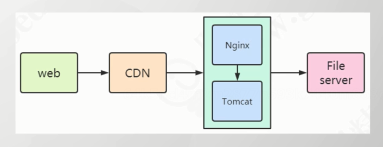

nginx的缓存其实也是也有自己缓存位置，所以我们一开始需要创建来存放这些缓存的地方。

```properties
mkdir -p /data/nginx/cache
```

然后我们需要在nginx的启动文件里添加如下配置，这个配置需要写在`include`的前面，一个proxy_cache_path一个是proxy_cache，一个表示缓存路径，一个是缓存的相关配置

```properties
#user  nobody;
worker_processes  1;

#error_log  logs/error.log;
#error_log  logs/error.log  notice;
#error_log  logs/error.log  info;

#pid        logs/nginx.pid;


events {
    worker_connections  1024;
}


http {
	## 添加在这里 --- start
	proxy_cache_path /data/nginx/cache levels=1:2 keys_zone=pop_cache:50m inactive=10m max_size=1g;
	## 添加在这里 --- end
    include       mime.types;
    default_type  application/octet-stream;
```

| 参数             | 作用                                                         |
| ---------------- | ------------------------------------------------------------ |
| proxy_cache_path | 缓存文件路径，其中的文件名是cache_key的MD5                   |
| levels           | 表示缓存目录下的层级目录结构，它是根据哈希后的请求URL地址创建的，目录名称从哈希后的字符结尾处开始截取。假设河西后的请求链接地址为4c45...dda7e5，则levels=1:2表示，第1层子目录的名称是长度为1的字符5，第二层子目录的名称是长度为2的字符7e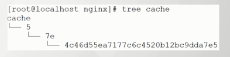 |
| keys_zone        | 指定缓存区名称及内存大小，在共享内存中设置一块存储区域来存放缓存的key和metadata(类似使用次数)，这样nginx可以快读判断一个request是否命中或者未命中缓存，1m可以缓存8000个key，10m可以存储80000个key |
| inactive         | 表示主动清空在指定时间内未被访问的缓存，10m代表10分钟        |
| max_size         | 最大的cache磁盘空间，如果不指定，会使用掉所有的disk space，当到达配额后，会删除最少使用的cache。 |

在上面配置完成后，我们需要在location 里面使用

```properties
location / {
    proxy_pass http://192.168.xx.xx:9096;
    # 使用前面定义的缓存内存对象
    proxy_cache pop_cache;
    # 需要忽略的项
    proxy_ignore_headers Expires Set-Cookie;
    # 对于 200 和 304 的响应码进行缓存，过期时间为1分钟，这会覆盖前面定义的10分钟过期时间。
    proxy_cache_valid 200 304 1m;
    # 设置缓存的key，nginx会根据这个公式换算成对应缓存key
    proxy_cache_key $host$uri$is_args$args;
    # 在返回的响应里面添加响应头 X-Proxy-Cache 其值表示是否命中了缓存
    add_header X-Proxy-Cache $upstream_cache_status;
}
```

| 状态              | 含义                                                         |
| ----------------- | ------------------------------------------------------------ |
| proxy_cache       | 当前定义的共享内存区域名称                                   |
| proxy_cache_key   | 缓存key的组合规划。比如：以域名、URI、参数组成的Web缓存的key值：$host$uri$is_args$args |
| proxy_cache_valid | 对不同的HTTP状态码设置不同的缓存时间，可以有多个#其它未设置的状态码缓存1分钟。proxy_cache_valid any 1m |
| proxy_set_header  | 定义http header 头，用于发送后代真实服务器，如果之前设置的真实的IP的案例。 |
| add_header        | 响应数据给客户端需要添加的头信息。                           |

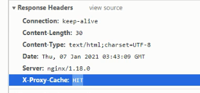

| 状态        | 含义                                                         |
| ----------- | ------------------------------------------------------------ |
| MISS        | 未命中缓存，请求真实的服务器                                 |
| HIT         | 命中缓存                                                     |
| EXPIRED     | 正在更新的缓存，将使用旧的应答                               |
| BYPASS      | 缓存被绕过了(可通过proxy_cache_bypass指令配置)               |
| STALE       | 无法从后代服务器更新时，返回了旧的缓存内容(可通过proxy_cache_use_stale指令配置) |
| UPDATING    | 内容过期了，因为相对于之前的请求，响应的入口(entry)已更新，并且proxy_cache_use_stale的updating已经被设置 |
| REVALIDATED | 启动proxy_cache_revalidate 指令后，当缓存内容过期时，Nginx通过一次if-Modified-Since的请求头去验证缓存内容是否过期，此时后返回该状态。 |

在缓存主动清理，即使服务器宕机，也会发拿回旧的内容，但是总比什么都没有强。

想要校验的话，你可以在请求的方法里面写上时间返回，查看时间有没有变动。

###### 缓存主动清理

nginx里面不提供主动清理缓存的功能的，所以默认情况下，缓存会在磁盘空间用满的情况下被动删除。如果说一个地方的数据更新了，而Nginx还是旧地内容的话，数据就不准确了。

这里需要用到nginx的第三方模块ngx_cache_purge;

```properties
# 1、下载解压
cd /usr/local/soft/nginx/modules
wget http://labs.frickle.com/files/ngx_cache_purge-2.3.tar.gz
tar -zxvf ngx_cache_purge-2.3.tar.gz

# 2、备份nginx启动文件
cd /usr/local/soft/nginx/sbin
cp nginx nginx.bak
#3、在nginx原解压目录下 add module
cd /usr/local/soft/nginx-1.18.0
./configure --prefix=/usr/local/soft/nginx --add-module=/usr/local/soft/nginx/modules/ngx_cache_purge-2.3
#4、在nginx原解压目录下make，确保没有错误
make
#5、检查是否安装成功
cd /usr/local/soft/nginx-1.18.0/objs
./nginx -V
#6、复制objs目录下的nginx文件到sbin目录
cp -rf nginx /usr/local/soft/nginx/sbin/
#7、重启Nginx
./nginx -c /usr/local/soft/nginx/conf/nginx-load.conf
```

接着在后面的配置追加

```properties
location ~/purge(/.*){
 	allow all;
    proxy_cache_purge pop_cahce $host$uri$is_args$args;
}
```

如果你的地址是`http://XXX/time/query`，想要删除这个的缓存，就前面加上/purge即，`http://XXX/purge/time/query`

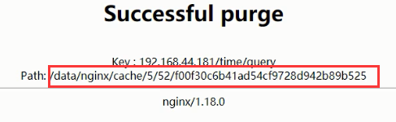

##### 动静分离

所谓的静是指的是静态资源，例如，css，js和图片这样的，提供的是不会改变的资源。

所谓的动指的是jsp，asp这种因为访问者的不同，呈现的内容也是不同的资源。我们通过将静态资源和动态资源剥离来达到更快的访问速度。因为动态资源和静态资源的特点不同，访问的速度也不一样，将动态资源和静态资源分别部署，可以达到提升访问速度、互不影响的目的。

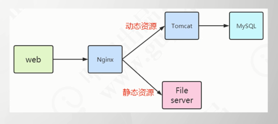

动静分离的配置实现中，也同样需要配置nginx的配置文件，既可以把静态文件放在其他的静态资源服务器上(还可以通过upstream负载)。不同类型的静态资源可以分别转发到不同的服务器。也可以根据客户端类型(浏览器、手机等等)转发到不同的地址。

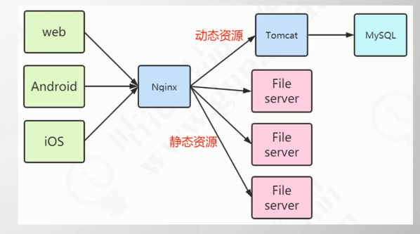

还有一种简单的做法，就是直接放在nginx‘的服务器上。

```properties
location ~ .*\.(html|htm|gif|jpg|jpeg|bmp|png|ico|js|css)$ {
    root /usr/local/soft/nginx/data/static
}
```

’比如把JS、PNG、GIF文件放在/usr/local/soft/nginx/data/static 目录下。

然后你在resource/templates创建一个index.html

```html
<!DOCTYPE html>
<html lang="en">
    <head>
        <meta charset="UTF-8">
        <title>Title</title>
    </head>
    <body>
        <div id="pop">
            
        </div>
        
        <script src="../jquery-3.3.1.js"></script>
    </body>
    <script>
    	$("#pop").html('加载jquery.js成功');
    </script>
</html>
```

关于上述的图片和js在这个springboot项目里是没有的，我们希望他去nginx的中配置好的静态资源下去拿。

首先如果你配置成功了，直接访问nginx的ip地址加上后的资源名是能够访问到的。

`http://xxxx/1.png`和`http://xxxx/jquery.js`，这个时候你直接访问index页面，会发现资源都可以拿到的。当这些静态资源想nginx发起请求的时候，这里我们需要注意一点的是这个时候nginx其实已经反向代理了我们的项目。所以当我们想nginx发起请求的时候，匹配到了png或者js结尾地资源请求，会去静态目录下找，这样就会返回资源。

##### 数据压缩配置

还记得我们安装nginx的时候有一些依赖的模块。

```properties
yum install -y 
gcc-c++ pcre pcre-devel 
zlib zlib-devel <---这个 
openssl openssl-devel
```

nginx将这个gzip的压缩进行了包含，也就是nginx是自带gzip的压缩功能的。nginx可以对一些资源进行一定程度上的压缩，例如文本，css，js，图片进行压缩，达到节省带宽的作用，但是这要浏览器是支持解压缩的功能的，不过现在大部分的浏览器基本都是标配这种解压缩的功能了。

但是有些资源是已经进行过压缩了，例如图片和mp3之类的，再进行压缩，压缩效果不怎么理想，且也耗费性能。

```properties
http {
    include       mime.types;
    default_type  application/octet-stream;
    
    # 压缩配置写在这里
    # 是否开启压缩 on开启 off关闭
    gzip on;
    # 支持的http协议
    gzip_http_version 1.1;
    # 压缩等级 1-9 等级越高压比例越大，同时消耗性能也越大
    gzip_comp_level 3;
    # 需要资源的资源
    gzip_types text/plain application/json application/javascript application/x-javascript application/css application/xml application/x-httpd-php image/jpeg image/gif
    image/png
    
    server {
        #...
    }
```

| 配置块名称                  | 作用                                                         |
| --------------------------- | ------------------------------------------------------------ |
| gzip on\|off;               | 是否开启gzip压缩                                             |
| gzip_comp_level level       | 压缩等级。由低到高1到9，默认为1。等级越高越消耗CPU资源。设置到3-5之间比较合适。 |
| gzip_disable "MSIE[1-6]\."; | 针对不同的客户端发起的请求有选择的打开或者关闭gzip命令，后面的浏览器的名称比如禁止IE的gzip功能 |
| gzip_min_length 1k          | gzip压缩的最小文件，小于设置值将不会压缩                     |
| gzip_http_version 1.0\|1.1  | 启用压缩功能时，协议的最小版本，默认http/1.1                 |
| gzip_buffer number size;    | 使用几个缓存空间，每个缓存空间的大小，用于缓存压缩结果，默认 32 4k\|16 8k |
| gzip_proxied off\|any;      | off为关闭，any为压缩所有后端服务返回的数据，如果有多个nginx服务，就要在中间Nginx开启 |
| gzip_types mine-type ...;   | 除了text/html外，还对指定的MIME类型启用的响应压缩。          |

#### 跨域访问

什么是跨域，什么又是同域。

同域：协议(http,https)、域名、端口都相同。以上三种任意一个不同，就是不同域。

例如。

| 域                                               | 是否同域             |
| ------------------------------------------------ | -------------------- |
| http://www.pop.com和https://www.pop.com          | 不同域，因为协议不同 |
| www.pop.com 和www.pop.net                        | 不同域，因为域名不同 |
| wiki.pop.com和bbs.pop.com                        | 不同域，子域名不同   |
| http://www.pop.com:2673和http://www.pop.com:2674 | 不同于，端口不同     |
| www.pop.com/index和www.pop.com/bbs               | 同域                 |

同源策略(Same-Origin Policy)：在浏览器中，一个域的文档或者他自己的脚本，不允许和另一个域的资源进行交互。

同源策略是浏览器保护用户的操作，防止第三方网站请求拿到返回的数据，比如cookie和请求的返回结果，起到保护服务器资源的作用。

比如骗子做了一个和中国银行一样的网站，你输入信息按下提交以后，他会代替你向真正的官网的脚本，提交数据。官网返回数据后，可以被诈骗网站获取，因为请求是诈骗网站获取的。

如果有同源策略，诈骗网站就无法显示数据。

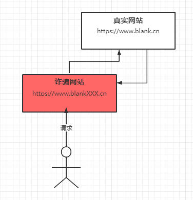

那么为什么，跨域的请求会出现问题，同源策略到底是哪一步起到的作用。其实问题在于不是跨域的请求无法请求服务器，而是请求确实完成后了，且返回了，但是被浏览器拦截下来，所以你也没法看到回显。他不允许第一个域（origin）获取第二个域的返回内容。

为此我们需要用到三个服务：

```
Nginx服务 ： 192.168.44.181：80
Tomcat1：    192.168.44.1：9096
Tomcat2：	192.168.44.1：9097 (被nginx代理)
```

很明显，tomcat1和tomcat2是不同域的，所以如果tomcat1去请求tomcat2的资源就会出现跨域问题。

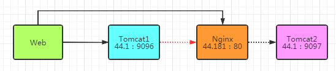

也就意味着`44.1：9096`访问`44.181：80`跨域。

首先我们在nginx反向代理tomcat2

```properties
location / {
    proxy_pass http://192.168.44.1:9097;
}
```

我们将nginx的所有请求发送给tomcat2。

首先，浏览器直接访问9097的 tomcat2是肯定可以成功的，因为同域，自己请求自己是没有什么问题的 `http://192.168.44.1:9097/time/query`或者我们请求nginx的地址，也是完全没问题的。`http://192.168.44.181/time/query`。

如果我们访问9096的tomcat1，在让tomcat1去请求9097的tomcat2的数据，就会出现跨域的问题。

由此，我们可以在9096的tomcat1上建立一个页面，在这个页面中我们回去请求tomcat2的数据，或者nginx的数据，nginx会帮我们转发到9097的tomcat2服务上去。来模拟跨域。

```javascript
<script type="text/javascript">
    $(document).ready(function(){
    $.ajax({
        type:"GET",
        url:"http://192.168.44.181/time/query",
        success:function(data){
            alert('跨域成功');
        },
        error:function(){
            alert('跨域失败');
        }
    });
	});
</script>
```

当我们这样操作的时候，会提示跨域失败，浏览器会出现失败字样，因为浏览器不允许我们执行跨域请求。

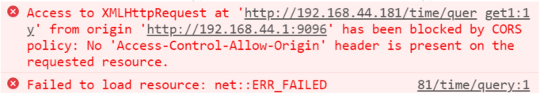

不过有些时候，我们是希望浏览器能够自己运行的js可以访问其他网站资源，比如网站嵌套微博个人签名，播放器，天气预报等。

浏览器里面出现地`CORS`字样，全程Cross-Origin Resource Sharing（跨域资源共享），其实就是一种解决同源策略限制的方法，只需要在被跨域的请求的服务器响应头添加`Access-Control-Allow-Origin`，允许origin访问就可以了。

###### 跨域解决方法

* **修改浏览器设置**

  * 自己百度，chrome跨域和Firefox跨域不一样。虽然修改浏览器可以解决，但是不可能要求所有用户都去改。

* **前端改为JSONP请求**

  * 也就是修改前端代码的请求方式，因为script标签的src、img的src以及link标签的href，是不会受到同源限制的。src或href链接的静态资源，本质上就是一个get请求，JSONP就利用这一点。当然，**这也决定了JSONP只能解决get的跨域问题。**

  * 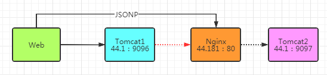

  * Jquery对JSONP的方法进行了封装。所以我们修改之前的请求。

    ```javascript
    <script type="text/javascript">
        $(document).ready(function(){
        $.ajax({
            type:"GET",
            dataType:"JSONP",
            jsonp:"callback",
            jsonpCallback:"successCallback",
            url:"http://192.168.44.181/time/query",
            success:function(data){
                alert('跨域成功');
            },
            error:function(){
                alert('跨域失败');
            }
        });
    	});
    </script>
    ```

  * 同时，请求的那个地址的返回值也要修改，返回数据必须用callback方法名字+括号括起来。

    ```java
    return "successCallback("+json.toJSONString()+")";
    ```

* **修改目标服务器后端代码**

  * 浏览器的浏览器策略之所以会拦截跨域而来的数据，是因为那些数据并没有携带通行证，也就是之前说的CORS，只要我们给响应头添加上这个，就被放行。

  * 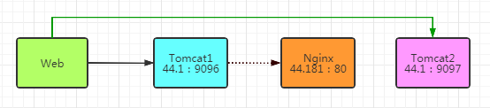

  * 我们可以在SpringBoot项目中，在请求的方法或者类上加上注解。

    ```java
    @CrossOrign
    @ResponseBody
    @RequestMapping("time/query")
    public String time(HttpServletResponse response)
    {
        //.....
    }
    ```

  * 当然，在类上加的效果，就是下面的所有请求，HTTP响应头都会带上CORS，那么效果就是会添加以下字段。

  * ```http
    "Access-Control-Allow-Origin":"*" ->匹配所有的域
    "Access-Control-Allow-Methods":"GET,POST,PUT,OPTIONS"
    "Access-Control-Allow-Credentials":"true"
    ```

  * 如果需要加注解的地方比较多，你可以添加配置或者拦截器

  * ```java
    @Configuration
    public class CORSConfiguration {
        public WebMvcConfigurer corsConfigurer(){
            return new WebMvcConfigurerAdapter(){
                @Override
                public void addCorsMappings(CorsRegistry registry)
                {
                    registry.addMapping("/**")
                        //当然，你也可以指定特定的域，例如你只允许
                        //http://192.168.44.181这个域访问
                        .allowedOrigins("*")
                        .allowedMethods("GET","POST","DELETE","PUT","OPTIONS")
                        .allowCredentials(false).maxAge(3600);
                }
            };
        }
    }
    ```

  * 这里需要注意的是，**如果你使用了这个拦截器的方式配置，那么请将之前的@CrossOrigin的注解注释掉**，不然会跨域失败，你会发现响应头会有重复的CORS。

* **Nginx代理设置**

  * 既然两个tomcat不同域，我让这两个tomcat同域不就行了，通过让nginx同时反向代理这两天服务器，请求发送给nginx，然后nginx帮忙转发，就不存在跨域的问题了。

  * ```properties
    server {
        listen 7298;
        server_name localhost;
        
        location / {
            proxy_pass http://192.168.44.1:9096;
        }
        
        localtion /time/ {
            proxy_pass http://192.168.44.1:9097;
        }
    }
    ```

  * 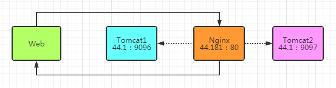

  * 这样，我们直接访问就不会有跨域问题。

    ```javascript
    <script type="text/javascript">
        $(document).ready(function(){
        $.ajax({
            type:"GET",
            url:"http://192.168.44.181:7298/time/query",
            success:function(data){
                alert('跨域成功');
            },
            error:function(){
                alert('跨域失败');
            }
        });
    	});
    </script>
    ```

* **在nginx转发的时候，添加CORS头信息。**

  * 如果解决的跨域地方比较多，很显然我们需要反向代理很多服务器，配置项还是会有点多的，所以在Nginx中设置第二种方法，在Ningx返回浏览器的时候，添加Access-Control-Allow-Origini头信息，告诉浏览器，他请求的源站是支持接收来自其他地址的数据的。

  * ```properties
    location / {
        proxy_pass http://192.168.44.1:9097;
        add_header 'Access-Control-Allow-Origin' '*';
        add_header 'Access-Control-AllowMethods' 'GET,POST,DELETE,PUT,OPTIONS';
        add_header 'Access-Control-Allow-Header' 'Content-TYPE,*';
    }
    ```

  * 同时，使用这个方法，**请注释掉CORSConfiguration和@CrossOrigin**。